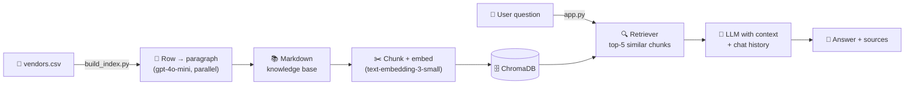

# 🎯 Event Planning AI Assistant

> A conversational AI that helps customers find event vendors matching their needs and budget — built on a **Retrieval-Augmented Generation (RAG)** pipeline over a structured vendor catalog.

<p align="left">
  
  
  
  
  
  
</p>

---

## ✨ What it does

Ask natural-language questions like:

- *"I need a florist in New York for under $500."*
- *"Compare the top-rated photographers."*
- *"Who can handle weddings with 300+ guests?"*

…and get answers grounded in your actual vendor catalog, with the source vendors cited inline.

## 🚀 Highlights

- **Conversational RAG** — multi-turn chat with persistent context; follow-ups Just Work
- **Cited answers** — every response lists which vendor records were used
- **Parallel ingestion** — rows are converted to RAG-ready paragraphs concurrently (8 workers by default)
- **Smart caching** — re-runs reuse generated paragraphs and embeddings when the source data hasn't changed
- **Modular architecture** — config, ingestion, indexing, and chat are isolated; swap the LLM, embedding model, or vector store without touching the rest
- **Single-source config** — every path, model name, and tunable lives in `src/config.py`, overridable via `.env`

## 🏗️ Architecture



Two clear phases:

1. **Index build** (`build_index.py`) — one-time, runs whenever the catalog changes. Reads the CSV, generates a clean prose paragraph per row via the LLM, writes one markdown file per vendor, then chunks + embeds everything into Chroma.
2. **Serve** (`app.py`) — loads the persisted Chroma index and exposes a Gradio chat UI backed by a LangChain RAG chain.

## 🚦 Quick start

### Prerequisites
- Python 3.10+
- An OpenAI API key

### Setup

```bash
# 1. Clone
git clone https://github.com/ghaderimaryam/event-plannig-ai-assistant.git
cd event-plannig-ai-assistant

# 2. Virtualenv
python3.11 -m venv .venv
source .venv/bin/activate          # Windows: .venv\Scripts\activate

# 3. Install
pip install --upgrade pip
pip install -r requirements.txt

# 4. Configure
cp .env.example .env
# then open .env and paste your OPENAI_API_KEY

# 5. Drop your vendor catalog at data/vendors.csv
#    (any columns; NAME_COLUMN in .env controls the filename column)
```

### Build the index

```bash
python build_index.py
```

This reads `data/vendors.csv`, generates a paragraph per vendor with `gpt-4o-mini`, writes the markdown knowledge base under `data/knowledge_base/`, and persists a Chroma index to `data/chroma_db/`. Subsequent runs reuse the cached paragraphs from `data/rag_ready.csv` if the row count hasn't changed.

### Launch the chat UI

```bash
python app.py
```

Then open the local URL Gradio prints (typically http://127.0.0.1:7860).

## 📁 Project structure

```
event-plannig-ai-assistant/
├── app.py                    # Entry point — launches the Gradio UI
├── build_index.py            # Entry point — builds the knowledge base & vector store
├── src/
│   ├── __init__.py
│   ├── config.py             # All paths, model names, tunables (env-driven)
│   ├── rag_text.py           # CSV row → RAG-friendly paragraph (parallel)
│   ├── knowledge_base.py     # Paragraphs → per-vendor markdown files
│   ├── vector_store.py       # Markdown → chunked & embedded Chroma index
│   ├── chat_engine.py        # RAG chain + Gradio-compatible chat callable
│   └── ui.py                 # Gradio Blocks layout
├── data/                     # Runtime artifacts (gitignored)
│   ├── vendors.csv           # ← you provide this
│   ├── knowledge_base/       # generated markdown
│   ├── chroma_db/            # generated vector store
│   ├── rag_ready.csv         # cached LLM-generated paragraphs
│   └── chunks.json           # same paragraphs as JSON
├── .env.example
├── .gitignore
├── LICENSE
├── requirements.txt
└── README.md
```

## 🧰 Tech stack

| Layer            | Choice                            | Why                                                                 |
| ---------------- | --------------------------------- | ------------------------------------------------------------------- |
| LLM              | OpenAI `gpt-4o-mini`              | Cheap and fast for both ingestion rewrites and chat responses       |
| Embeddings       | OpenAI `text-embedding-3-small`   | Strong quality-to-cost ratio; 1536-dim vectors                      |
| Vector store     | ChromaDB (persisted to disk)      | Zero-infrastructure, file-based, drop-in compatible with LangChain  |
| Orchestration    | LangChain                         | Standard primitives for prompts, retrievers, and chat history       |
| UI               | Gradio                            | Production-quality chat UI in ~20 lines                             |
| Concurrency      | `concurrent.futures.ThreadPoolExecutor` | OpenAI calls are I/O-bound; threads are sufficient and simple |

## ⚙️ Configuration

Every knob is in `src/config.py` and overridable via `.env`. The most useful:

| Variable        | Default                         | Purpose                                       |
| --------------- | ------------------------------- | --------------------------------------------- |
| `OPENAI_API_KEY`| —                               | Required                                      |
| `MODEL_GEN`     | `gpt-4o-mini`                   | Chat + ingestion model                        |
| `MODEL_EMBED`   | `text-embedding-3-small`        | Embedding model                               |
| `CSV_PATH`      | `./data/vendors.csv`            | Source catalog                                |
| `NAME_COLUMN`   | `vendor_name`                   | Column used to name the markdown files        |
| `MAX_WORKERS`   | `8`                             | Parallel LLM calls during ingestion           |

## 🧠 How it works

**Ingestion.** The vendor CSV is dynamic — any columns work. For each row, the LLM is prompted to write a 2–3 paragraph self-contained description that reads as natural prose (better embeddings than raw key-value strings). The 8 parallel workers turn what would be sequential API calls into a brief burst of activity.

**Indexing.** Each markdown file is chunked with `RecursiveCharacterTextSplitter` (1000 chars, 200 overlap) and embedded into Chroma. The vendor name is preserved in metadata so it can be cited at retrieval time.

**Retrieval & generation.** On each user turn, the retriever pulls the top 5 most similar chunks. They're stuffed into the system prompt alongside the running chat history (translated from Gradio's UI state into LangChain messages on every call — no global mutable history). The LLM writes the answer; we deduplicate the source vendor names from the retrieved chunks and append them as a footer.

## 🛣️ Roadmap

- [ ] Hybrid search (BM25 + dense) for queries with hard constraints like budget caps
- [ ] Streaming responses in the Gradio UI
- [ ] Evaluation harness with a fixed Q&A set + automatic grading
- [ ] Vendor metadata filtering (location, price tier) at retrieval time
- [ ] Dockerfile + one-command deploy

## 📜 License

MIT — see [LICENSE](LICENSE).

## 👤 Author

**Maryam Ghaderi** — [GitHub](https://github.com/ghaderimaryam)
